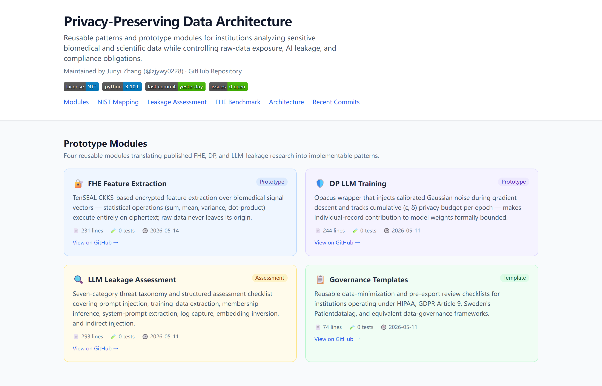

# Privacy-Preserving Data Architecture

[](LICENSE)
[](https://www.python.org/downloads/)
[](https://github.com/zjywy0228/privacy-preserving-data-architecture/commits/master)

Reusable architecture patterns, prototype modules, and assessment frameworks for institutions that need to analyze sensitive biomedical and scientific data while controlling raw-data exposure, AI leakage risk, and compliance obligations.

Maintained by Junyi Zhang ([@zjywy0228](https://github.com/zjywy0228)). Issues and feedback welcome.

**[→ Live project dashboard](https://zjywy0228.github.io/privacy-preserving-data-architecture/)** — module status, NIST control mappings, leakage assessment results, FHE benchmark timings, and live commit feed.

[](https://zjywy0228.github.io/privacy-preserving-data-architecture/)

## Motivation

Modern biomedical and scientific research increasingly depends on cross-institutional data collaboration. Two recurring constraints make that collaboration difficult:

1. **Regulatory and ethical limits on raw-data movement.** Patient records, pediatric clinical data, health registry data, genomic data, and equivalent scientific datasets are subject to HIPAA, GDPR Article 9, Sweden's *Patientdatalag*, and related frameworks that restrict how raw records can be shared, copied, or moved across systems and jurisdictions.

2. **AI-era data-leakage risk.** AI and large language model (LLM) systems trained on or given access to sensitive data can expose that data through memorization, membership inference, prompt injection, log capture, and downstream tool leakage — risks that conventional access-control architectures were not designed for.

This repository translates research on **fully homomorphic encryption (FHE)**, **differential privacy (DP)**, and **LLM data-leakage assessment** into practical architecture patterns and prototype modules that research teams, hospital IT groups, and compliance reviewers can evaluate and adapt.

## Research Foundation

This work builds on the following published research:

| Paper | Venue | DOI / Link |
|---|---|---|
| *Privacy-Preserving Feature Extraction for Medical Images Based on Fully Homomorphic Encryption* | MDPI Applied Sciences (2024) | [doi:10.3390/app14062531](https://doi.org/10.3390/app14062531) |
| *A Differential Privacy-Based Mechanism for Preventing Data Leakage in Large Language Model Training* | Springer Neural Processing Letters (2025) | [doi:10.1007/s11063-024-11604-9](https://doi.org/10.1007/s11063-024-11604-9) |
| *Assessment Methods and Protection Strategies for Data Leakage Risks in Large Language Models* | IEEE (2025) | see paper for full reference |
| *Hospital-treated infectious diseases and the risk of epilepsy in older age* | Nature Aging (2025) | [doi:10.1038/s43587-024-00783-8](https://doi.org/10.1038/s43587-024-00783-8) |
| *Growth and sleep outcomes after adenotonsillectomy in pediatric mild sleep-disordered breathing* | Scientific Reports (2025) | see paper for full reference |

The Nature Aging and Scientific Reports biomedical papers are the application context that motivates this repository: both required controlled, governed access to sensitive patient records across jurisdictions, and both show why reusable architecture patterns matter for research teams that cannot redesign their data-handling from scratch for each new study.

## Repository Structure

```
privacy-preserving-data-architecture/
├── architectures/                # Reference architectures (institution-agnostic, paper-anchored)
│   ├── README.md                 # pattern index
│   └── biomedical-reference-architecture.md  # four-layer clinical/registry governed-data design
├── fhe-feature-extraction/       # FHE pipeline for encrypted medical-image features
│   ├── fhe_pipeline.py
│   └── examples/
├── dp-llm-training/              # Differential privacy wrapper for LLM/ML training
│   ├── dp_trainer.py
│   └── examples/
├── llm-leakage-assessment/       # LLM data-leakage threat taxonomy and checklist
│   ├── ASSESSMENT-CHECKLIST.md
│   └── threat-taxonomy.md
├── governance-templates/         # Data minimization template
│   └── data-minimization-checklist.md
└── docs/compliance/
    └── nist-control-mapping.md
```

## Quick Start

### FHE Feature Extraction

```bash
pip install tenseal numpy Pillow scikit-learn
python fhe-feature-extraction/examples/basic_usage.py
```

### Differential Privacy Training

```bash
pip install opacus torch transformers
python dp-llm-training/examples/demo_training.py
```

### LLM Leakage Assessment

Review `llm-leakage-assessment/ASSESSMENT-CHECKLIST.md` for the structured workflow. The Python runner (`assessment_runner.py`) automates the prompt-injection and log-capture test cases.

## Deliverable Roadmap

| Phase | Target | Status |
|---|---|---|
| Phase 1 | Initial FHE prototype, DP wrapper, LLM leakage checklist | Complete |
| Phase 1.2 | Biomedical reference architecture — four-layer design anchored to Nature Aging + Scientific Reports papers | **Live** (2026-05-12) |
| Phase 2 | Deployment patterns for pediatric/clinical and population-health workflows; requirements and CI | In progress |
| Phase 3 | Validated compliance-ready architecture suite with NIST/HIPAA control mappings | Planned |
| Phase 4 | Peer-reviewed architecture papers and public validation reports | Planned |

## Target Users

- **Biomedical research teams** setting up cross-institutional studies on patient-level data
- **Hospital IT and compliance groups** evaluating AI tools for clinical data environments
- **Scientific collaboration teams** managing access to sensitive simulation, calibration, or pre-publication research data
- **Data engineers and security architects** building privacy-conscious ML pipelines on regulated data

## Federal Policy Alignment

This work is designed to be compatible with:

- [NIST Privacy Framework](https://www.nist.gov/privacy-framework)
- [NIST AI Risk Management Framework (AI RMF)](https://www.nist.gov/system/files/documents/2023/01/26/AI%20RMF%201.0.pdf)
- [NIST Adversarial ML Report (2025)](https://nvlpubs.nist.gov/nistpubs/ai/nist.ai.100-2e2025.pdf)
- [CISA AI Data Security Best Practices](https://www.cisa.gov/resources-tools/resources/guidelines-secure-ai-system-development)
- [HHS OCR HIPAA Security Rule](https://www.hhs.gov/hipaa/for-professionals/security/index.html)
- [National Strategy to Advance Privacy-Preserving Data Sharing and Analytics (PPDSA)](https://www.whitehouse.gov/wp-content/uploads/2023/03/National-Strategy-to-Advance-Privacy-Preserving-Data-Sharing-and-Analytics.pdf)

## Citation

If you use materials from this repository in your research, please cite the relevant papers above.

## License

MIT License. See [LICENSE](LICENSE).

## Contributing

See [CONTRIBUTING.md](CONTRIBUTING.md) for how to contribute code, documentation, and architecture patterns.

---

## AI-Assistance Disclosure

Some commits in this repository were prepared with AI coding assistance (Claude). All AI-generated code has been reviewed and tested by the maintainer before merge. The architectural decisions, threat models, and design choices reflect the maintainer's own research direction.

The use of AI coding assistance is itself within the scope of this repository's `llm-leakage-assessment/` module — see [`docs/ai-assistance-policy.md`](docs/ai-assistance-policy.md) for how AI-assisted contributions are reviewed, tested, and disclosed.

---

*This is an active research project; architecture patterns and prototype implementations will evolve. Interfaces may change between minor versions.*
