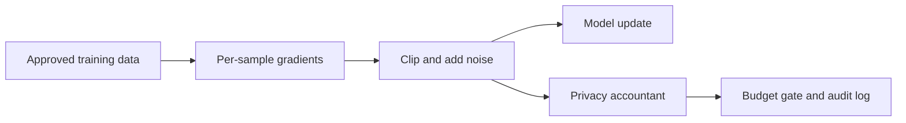

# Threat Model: Differential-Private Training

## Scope

This model covers the `dp-llm-training/` wrapper, privacy-budget calculator,
budget accountant, and audit-log validator. It focuses on training-time privacy
controls and the correctness of privacy accounting.

## Assets

- raw training examples and labels;
- per-sample gradients and intermediate activations;
- clipping norms, noise multipliers, sample rates, and random state;
- cumulative epsilon and delta budget state;
- model checkpoints and outputs;
- privacy audit logs.

## Trust boundaries

The privacy accountant is a control boundary: training must stop or require an
explicitly approved override when the configured budget is exhausted.

## Threats and controls

| ID | Threat event | Security/privacy effect | Repository control | Validation |
|---|---|---|---|---|
| DP-T1 | Missing or incorrect per-sample clipping | A single record can dominate an update | Explicit maximum gradient norm | Unit tests around clipping and configuration |
| DP-T2 | Noise multiplier is too low | Membership or reconstruction risk exceeds policy | Parameter calculator and target budget | Sensitivity analysis across noise values |
| DP-T3 | Sample rate, step count, or composition is misreported | Epsilon is understated | Central budget accountant and structured log | Recompute budget from saved run parameters |
| DP-T4 | Training continues after budget exhaustion | Privacy guarantee no longer matches the approved run | Budget-exhaustion gate | Boundary tests at and above the target epsilon |
| DP-T5 | Raw examples or gradients enter logs | Direct disclosure outside the model | Minimal audit schema excludes training content | Schema validation and log-content review |
| DP-T6 | Checkpoints or evaluation outputs memorize rare records | Leakage after apparently valid training | Pair DP with leakage assessment | Membership-inference and extraction tests |
| DP-T7 | Non-cryptographic or reused randomness weakens noise | Predictable privacy mechanism | Production cryptographic random source requirement | Deployment configuration and reproducibility review |
| DP-T8 | Hyperparameter search consumes untracked privacy budget | Composition is incomplete | Treat each data-dependent trial as budgeted work | Experiment registry and aggregate accounting |

## Privacy assumptions

- The neighboring-dataset definition matches the deployment's privacy claim.
- Sampling and accounting assumptions match the actual training loop.
- Every data-dependent training or tuning run is included in composition.
- Reported epsilon is always paired with delta, model version, dataset version,
  sampling method, step count, clipping norm, and noise multiplier.

## Residual risks

Differential privacy bounds the influence of individual records under stated
assumptions. It does not make arbitrary training data safe, prevent all model
abuse, or replace access control. Utility degradation, group privacy, repeated
releases, pretraining data provenance, and non-training inference channels need
separate review.
