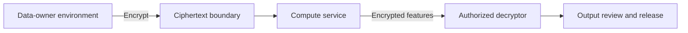

# Threat Model: FHE Feature Extraction

## Scope

This model covers encrypted feature extraction using the
`fhe-feature-extraction/` prototype. The intended pattern encrypts an input at
the data-owner boundary, performs approved operations on ciphertext, and
decrypts only the permitted derived result.

## Assets

- raw biomedical or scientific input;
- secret and public encryption material;
- ciphertext and evaluation keys;
- feature-extraction parameters and code;
- decrypted derived features;
- benchmark, error, and audit records.

## Trust boundaries

The data owner and authorized decryptor may be separate roles. The compute
service is not trusted with plaintext or the secret key.

## Threats and controls

| ID | Threat event | Security/privacy effect | Repository control | Validation |
|---|---|---|---|---|
| FHE-T1 | Ciphertext or evaluation-key theft | Offline analysis or denial of service | No secret keys in repository; encryption/decryption boundary is explicit | Secret scan and deployment key inventory |
| FHE-T2 | Secret key reaches the compute service | Complete loss of plaintext confidentiality | Separate encrypt/decrypt interfaces; key ownership documented outside compute tier | Architecture review and runtime configuration check |
| FHE-T3 | Weak polynomial degree or coefficient parameters | Reduced cryptographic security or incorrect computation | Parameterized pipeline with documented defaults | Parameter review against the selected library's current guidance |
| FHE-T4 | Malformed ciphertext or unauthorized operation | Integrity failure, exceptions, or resource exhaustion | Input-shape checks and bounded feature operations | Unit tests, negative tests, and service resource limits |
| FHE-T5 | Derived features reveal sensitive input attributes | Privacy loss despite encrypted computation | Output minimization and pre-export review templates | Attribute-inference test and human output review |
| FHE-T6 | Approximation error changes a decision | Incorrect scientific or clinical interpretation | Round-trip error and accuracy benchmarks | Compare encrypted and plaintext reference results |
| FHE-T7 | Timing, memory, or access-log metadata leaks workload details | Side-channel disclosure | Minimize operational metadata and restrict logs | Deployment-specific side-channel and logging review |
| FHE-T8 | Dependency or implementation compromise | Key/data compromise or incorrect results | Pinned review process and continuous tests | Dependency audit, reproducible test run, signed release verification |
| FHE-T9 | Unauthorized or replayed federated update | Model poisoning, incorrect aggregate, or participation disclosure | Authorized-client allowlist, round binding, duplicate rejection, payload limits, ciphertext fingerprints | Federated coordinator negative tests and durable deployment replay control |

## Security assumptions

- The selected fully homomorphic encryption scheme and parameters provide the
  intended security level for the deployment.
- The compute service cannot access the secret key.
- The authorized decryptor releases only reviewed features.
- Approximate arithmetic error is measured against a defined acceptance
  threshold for the workload.

## Residual risks

Fully homomorphic encryption protects data in use; it does not by itself prove
that an output is safe to release, that the computation is authorized, or that
the implementation is free of side channels. Production deployments still need
identity controls, key rotation, tamper-evident logs, resource isolation,
dependency monitoring, and an approved output-release process.

For federated use, the server must also authenticate clients, bind each
ciphertext to a unique round, protect transport metadata, and persist replay
state across process restarts.
