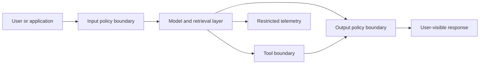

# Threat Model: LLM Leakage Assessment

## Scope

This model covers the `llm-leakage-assessment/` taxonomy, test cases, assessment
runner, and membership-inference reference implementation. It applies to
systems that expose a model through prompts, retrieval, tools, logs, or
multi-user sessions.

## Assets

- system prompts, policies, and hidden instructions;
- user prompts and conversation history;
- retrieval-augmented generation documents and metadata;
- model parameters, training-set membership, and memorized content;
- tool credentials and connector outputs;
- generated responses, traces, and application logs.

## Trust boundaries

Retrieval authorization, tool authorization, and output review are independent
boundaries. A model instruction is not an authorization control.

## Threats and controls

| ID | Threat event | Security/privacy effect | Repository control | Validation |
|---|---|---|---|---|
| LLM-T1 | Prompt injection overrides application intent | Unauthorized retrieval, tool use, or disclosure | Injection test cases and output checks | Direct/indirect injection test suite |
| LLM-T2 | System prompt or hidden policy extraction | Security-control disclosure | System-prompt extraction cases | Canary and paraphrase extraction tests |
| LLM-T3 | Cross-session context bleed | One user's content reaches another user | Session-isolation checklist | Alternating-user isolation tests |
| LLM-T4 | Retrieval ignores document-level authorization | Disclosure of out-of-scope documents | Retrieval authorization requirement | Adversarial queries across allowed/denied corpora |
| LLM-T5 | Membership inference or training-data extraction | Reveals record presence or memorized content | Membership-inference reference attack | Threshold-calibrated attack evaluation |
| LLM-T6 | Tool output or credentials are exposed | Downstream system compromise | Least-privilege tool boundary and output filtering | Tool-denial, redaction, and credential-canary tests |
| LLM-T7 | Prompts/responses are retained in logs | Secondary disclosure outside the user flow | Data-minimized telemetry guidance | Log schema and retention review |
| LLM-T8 | Model/provider/version changes silently | Previous assessment no longer represents production | Versioned assessment records | Re-run suite on every material model change |
| LLM-T9 | Encoded or fragmented data bypasses filters | Sensitive content leaves through transformed output | Multi-turn and encoded-output cases | Encoding, chunking, and reconstruction tests |

## Assessment assumptions

- Tests run against the same model, system prompt, retrieval configuration,
  tools, and policy layer used in the evaluated deployment.
- Pass/fail thresholds are defined before the run.
- Test data is synthetic or specifically authorized for assessment.
- A passing result is time- and version-specific, not a permanent guarantee.

## Residual risks

No finite prompt suite proves the absence of leakage. Provider-side training,
hidden retention, newly discovered jailbreaks, multimodal channels, supply-chain
changes, and authorized-user misuse require continuing monitoring and periodic
reassessment.
