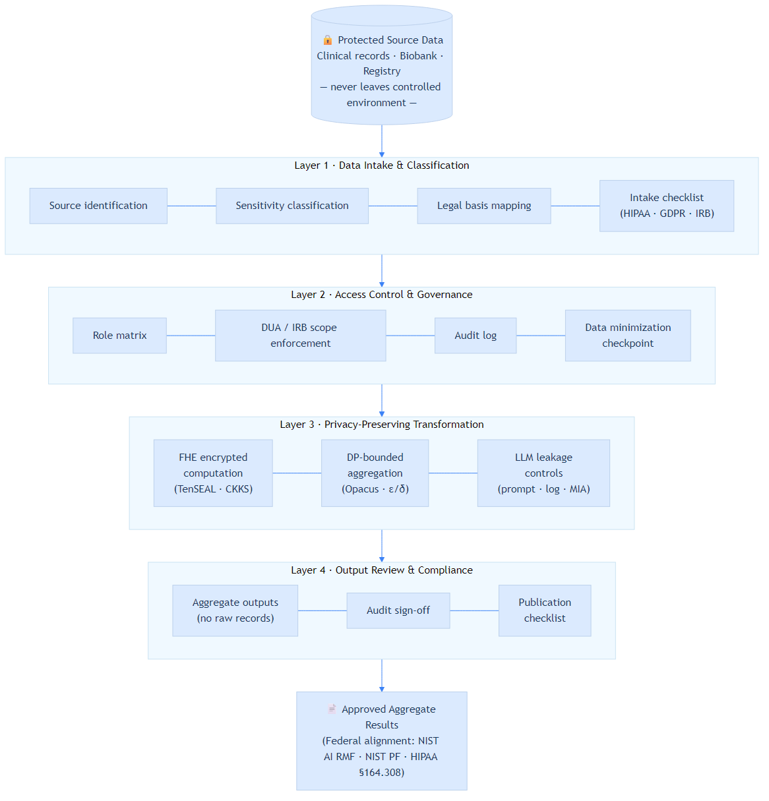
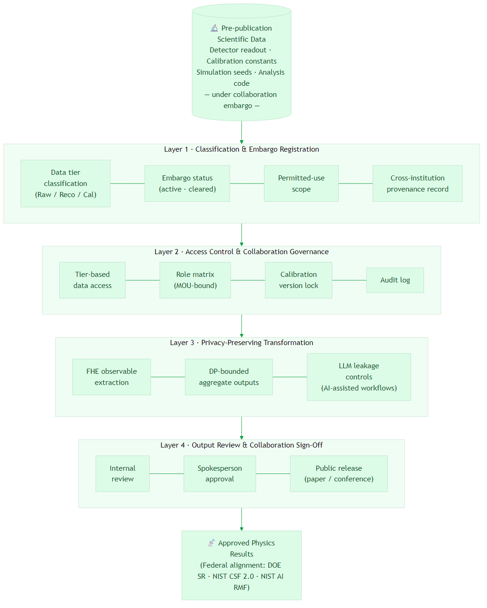
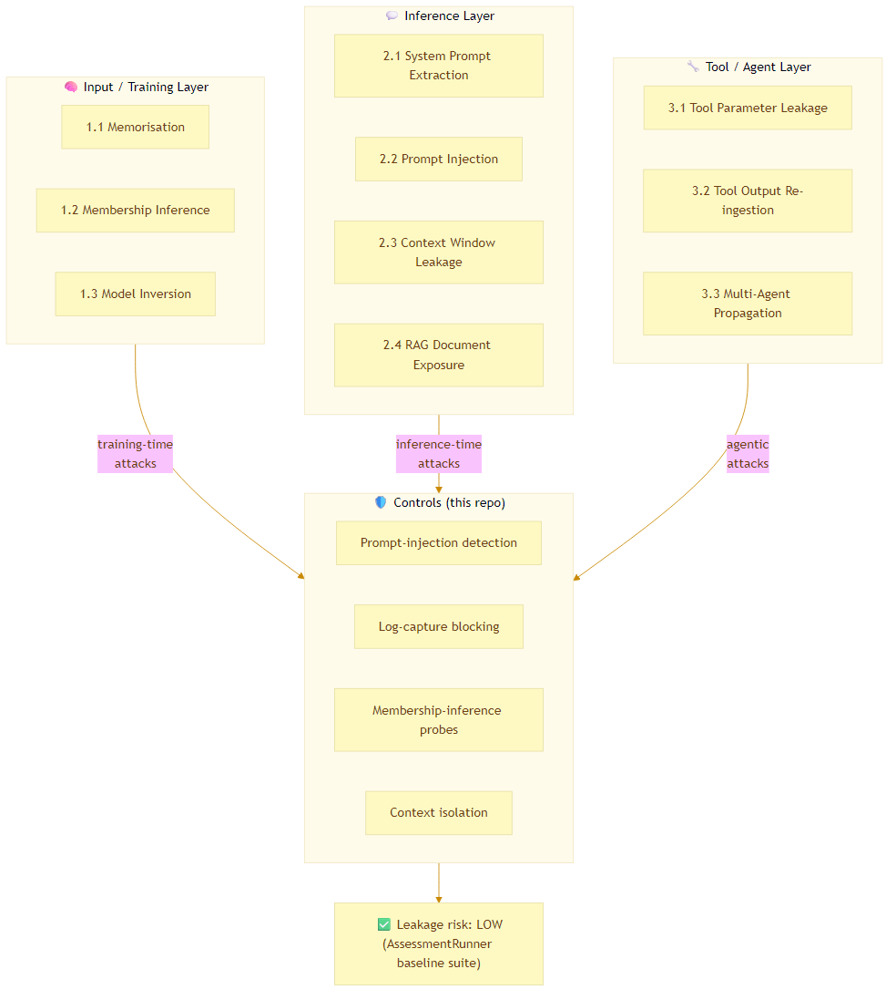

# Architecture Diagram Gallery

Rendered PNG exports of all Mermaid architecture diagrams in this repository.
Source `.mmd` files are co-located; regenerate with:

```bash
npx @mermaid-js/mermaid-cli -i <name>.mmd -o <name>.png -w 1200
```

---

## Biomedical Reference Architecture

Four-layer privacy-preserving workflow for clinical and population-health research.
Federal alignment: NIST AI RMF · NIST Privacy Framework · HIPAA §164.308.

[](../architectures/biomedical-reference-architecture.md)

---

## Scientific Collaboration Controlled-Access Architecture

Four-layer controlled-access workflow for large-scale multi-institution scientific
collaborations (physics experiments, genomics consortia, climate modeling).
Federal alignment: DOE SR · NIST CSF 2.0 · NIST AI RMF.

[](../architectures/scientific-collaboration-controlled-access.md)

---

## LLM Leakage Threat Taxonomy

Three-layer threat model covering training-time, inference-time, and agentic
leakage vectors, mapped to the controls implemented in `llm-leakage-assessment/`.

[](../llm-leakage-assessment/threat-taxonomy.md)

---

| Diagram | Source | PNG size |
|---|---|---|
| Biomedical Reference Architecture | [`biomedical-reference-architecture.mmd`](biomedical-reference-architecture.mmd) | 60 KB |
| Scientific Collaboration Controlled Access | [`scientific-collaboration-controlled-access.mmd`](scientific-collaboration-controlled-access.mmd) | 64 KB |
| LLM Leakage Threat Taxonomy | [`llm-leakage-threat-taxonomy.mmd`](llm-leakage-threat-taxonomy.mmd) | 47 KB |
